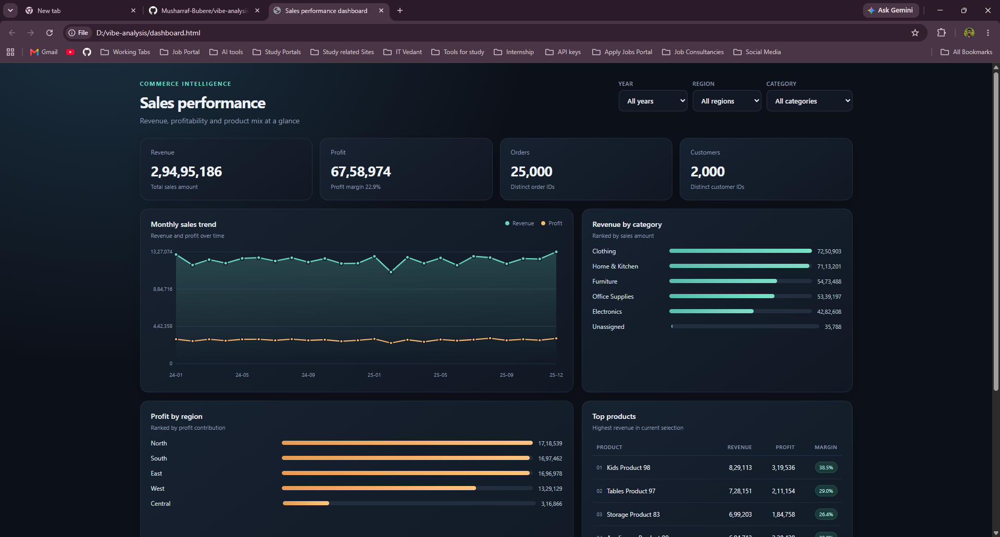

# 📊 Vibe Analysis — Sales Dashboard

An interactive dashboard for exploring order revenue, profit, customer activity, category mix, regional performance, and top products. The dashboard is a self-contained HTML file built from the project’s cleaned order facts and product and region dimensions.

## ✨ Dashboard

Open [`dashboard.html`](dashboard.html) in a modern browser. Use the **Year**, **Region**, and **Category** filters to update the KPIs and charts.

The dashboard shows:

- 💰 Revenue and profit, with profit margin
- 🧾 Order count and distinct customer count
- 📈 Monthly revenue and profit trend
- 🗂️ Revenue by product category
- 🌍 Profit by region
- 🏆 Top 10 products by revenue, including profit and margin

The dashboard includes returns as recorded in the fact table. Orders without a valid date contribute to the summary totals but cannot appear in the monthly trend. Monetary amounts use the units in the source data; no currency is specified.

## 🖼️ Screenshots

### Sales performance dashboard



## 🛠️ Rebuild the dashboard

Requires Python 3. The generator uses only Python’s standard library.

```powershell
python scripts/build_dashboard.py
```

This reads `Data/facts/fact_orders.csv`, `Data/dimensions/dim_product.csv`, and `Data/regions_raw.csv`, then writes `dashboard.html` in the project root. The generated file embeds the order data and works without a server or network connection.

## 🗃️ Project layout

```text
Data/
  facts/fact_orders.csv          Cleaned order-level sales and profit
  dimensions/                    Product, date, and customer dimensions
  *_raw.csv                      Raw source tables
scripts/
  clean_orders.py                Clean and flag order records
  clean_products.py              Clean product attributes
  clean_customers.py             Clean customer records
  build_dim_date.py              Build the date dimension
  build_dashboard.py             Generate the interactive dashboard
dashboard.html                   Self-contained interactive dashboard
```

## 📌 Data notes

- Dashboard category labels use the product dimension’s `expected_category` field.
- Dashboard regions are joined from the region dimension.
- Customer totals count distinct non-empty customer IDs in the selected rows.
- Monthly trend groups dated orders by year and month; rows with invalid dates are excluded from that chart.
